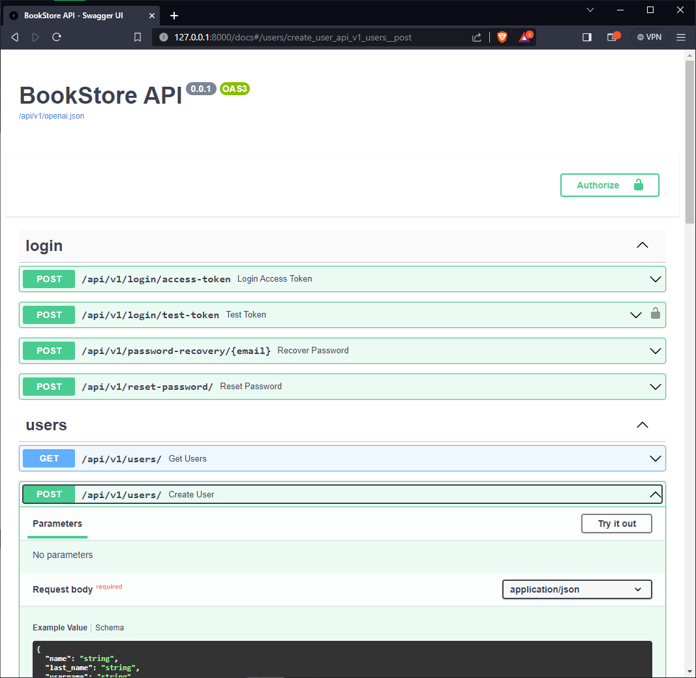
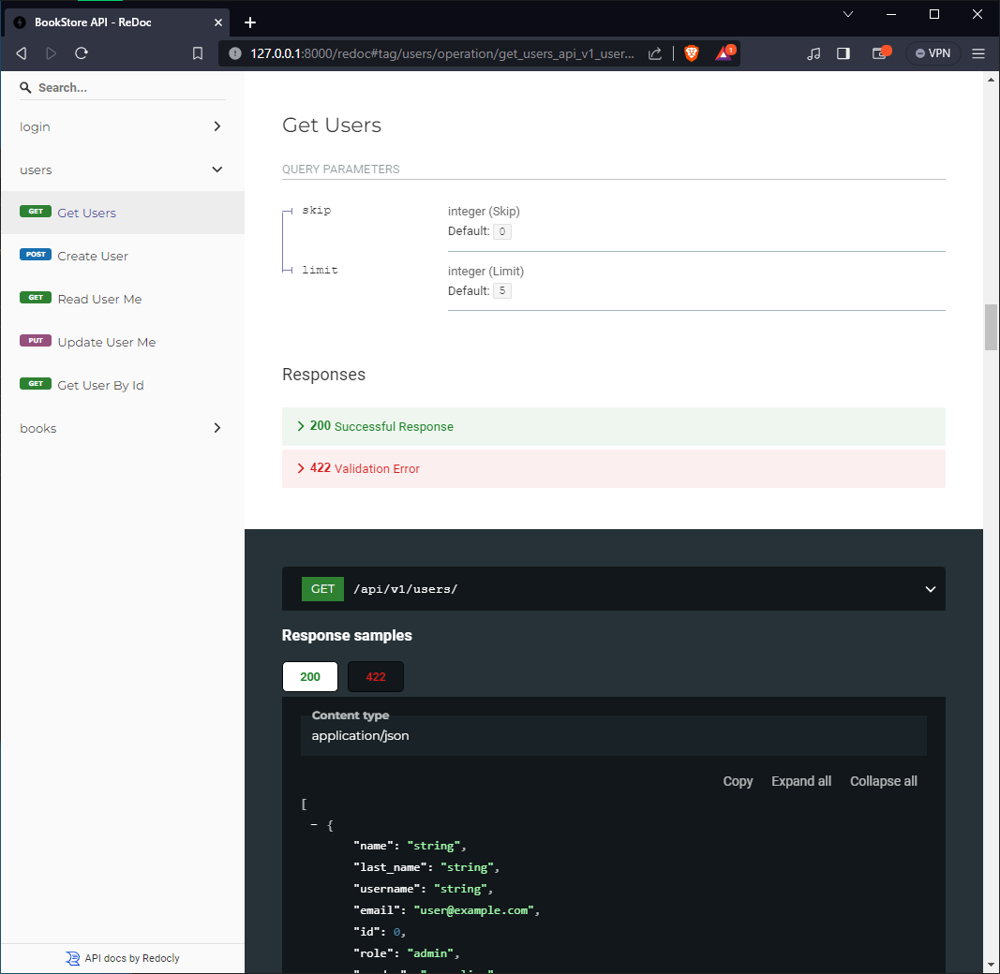

# BookStoreAPI

### Interactive API documentation

[](https://github.com/reduhq/BookStoreAPI)

### Alternative API documentation

[](https://github.com/reduhq/BookStoreAPI)


## Features

* Full **Docker** integration (Docker based).
* Python <a href="https://github.com/tiangolo/fastapi" class="external-link" target="_blank">**FastAPI**</a> backend:
    * **Fast**: Very high performance, on par with **NodeJS** and **Go** (thanks to Starlette and Pydantic).
    * **Intuitive**: Great editor support. <abbr title="also known as auto-complete, autocompletion, IntelliSense">Completion</abbr> everywhere. Less time debugging.
    * **Easy**: Designed to be easy to use and learn. Less time reading docs.
    * **Short**: Minimize code duplication. Multiple features from each parameter declaration.
    * **Robust**: Get production-ready code. With automatic interactive documentation.
    * **Standards-based**: Based on (and fully compatible with) the open standards for APIs: <a href="https://github.com/OAI/OpenAPI-Specification" class="external-link" target="_blank">OpenAPI</a> and <a href="http://json-schema.org/" class="external-link" target="_blank">JSON Schema</a>.
    * <a href="https://fastapi.tiangolo.com/features/" class="external-link" target="_blank">**Many other features**</a> including automatic validation, serialization, interactive documentation, authentication with OAuth2 JWT tokens, etc.
* **Secure password** hashing by default.
* **JWT token** authentication.
* **SQLAlchemy** models (independent of Flask extensions, so they can be used with Celery workers directly).
* Basic starting models for users
* **Alembic** migrations.
* **CORS** (Cross Origin Resource Sharing).
* REST backend tests based on **Pytest**, integrated with Docker, so you can test the full API interaction, independent on the database. As it runs in Docker, it can build a new data store from scratch each time 
* **PGAdmin** for PostgreSQL database.


## Requirements

* [Docker](https://www.docker.com/).
* [Docker Compose](https://docs.docker.com/compose/install/).
* [Poetry](https://python-poetry.org/) (OPTIONAL) for Python package and environment management.


## How to run it
* Go to the root path of the project and run the following command

```bash
docker compose up --build -d
```

* Now you can open your browser and interact with these URLs:

Automatic interactive documentation with Swagger UI (from the OpenAPI backend): http://127.0.0.1:8000/docs

Alternative automatic documentation with ReDoc (from the OpenAPI backend): http://127.0.0.1:8000/redoc

PGAdmin, PostgreSQL web administration: http://127.0.0.1:80 (email: reduhq@gmail.com | password: reduhq)


**Note**: The first time you start your stack, it might take a minute for it to be ready. While the backend waits for the database to be ready and configures everything. You can check the logs to monitor it.

To check the logs, run:

```bash
docker-compose logs
```

To check the logs of a specific service, add the name of the service, e.g.:

```bash
docker-compose logs api
```

## How to run the tests
* Go to the root path of the project and run the following command
```bash
./scripts/test.sh
```